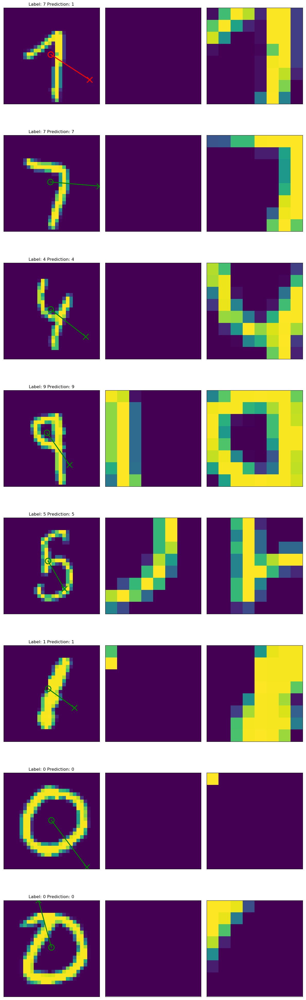
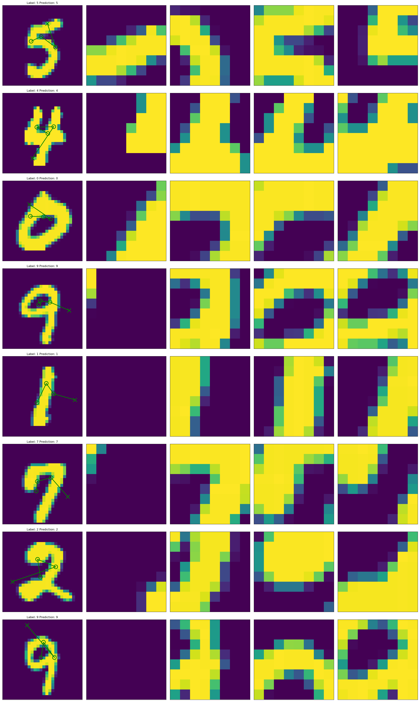
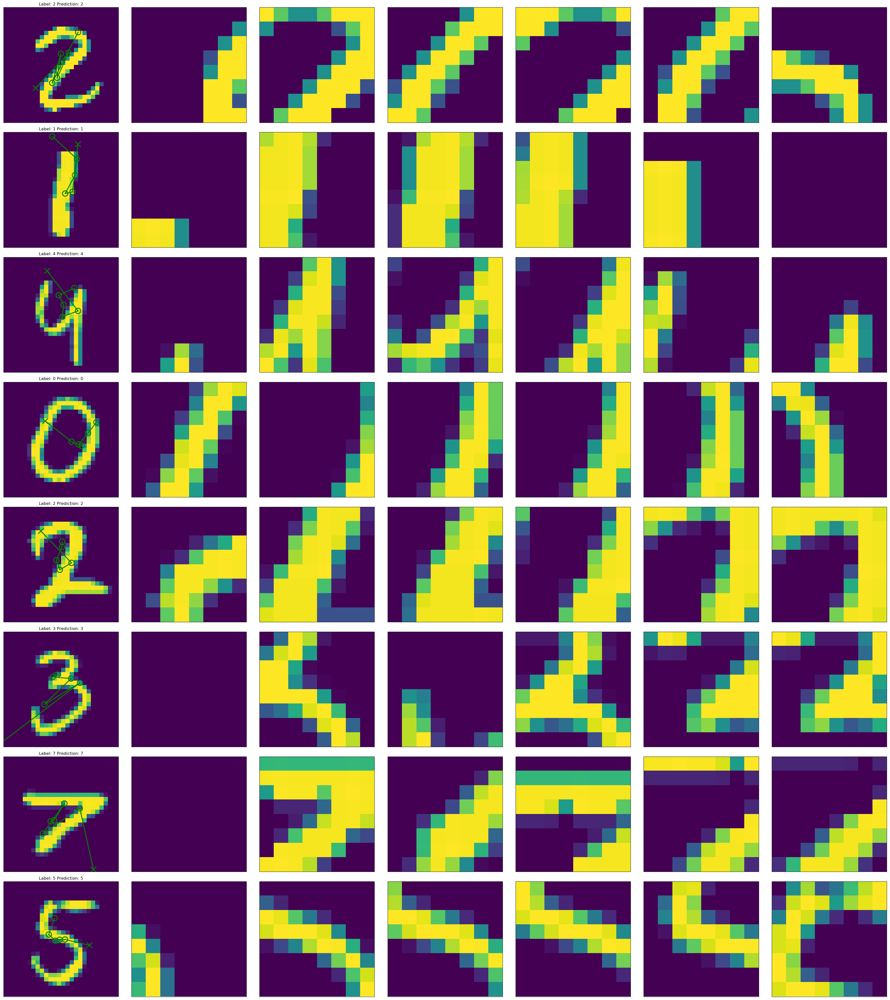

# Recurrent Attention Model

### Overview
This is my tensorflow implementation of Mnih et al.'s [Recurrent Models of Visual Attention](https://arxiv.org/pdf/1406.6247.pdf). It is trained with a hybrid loss:  
- Learn to classify the digits based on the RNN output in a supervised manner.
- Learn where to look next based on the RNN output. This is non-differentiable and therefore trained by reinforcement learning, using policy gradients (which easily allows to learn continuous actions of (x,y) coordinates).  

Thanks to [1] (in turn based on [2]) who's implementation provided me with a starting point. After addressing a number of issues, especially regarding the gradient flow, this implementation achieves the original paper's performance in roughly 100 epochs or 2 hours of training on my laptop's Geforce 940MX (for four glimpses). The resulting code is to 95% my own work.

### Results
The following was achieved without any extensive hyperparameter search.

28x28 MNIST:

| Model  | Error Mnih et al. | Error this implementation |
| ------------- | ------------- | ------------- |
| RAM, 2 glimpses, 8 x 8, 1 scale  | 6.27%  | 7.17%  |
| RAM, 4 glimpses, 8 x 8, 1 scale  | 1.73%  | 1.89%  |
| RAM, 6 glimpses, 8 x 8, 1 scale  | 1.29%  | 1.57%  |

60x60  Translated MNIST:

| Model  | Error Mnih et al. | Error this implementation |
| ------------- | ------------- | ------------- |
| RAM, 4 glimpses,  8 x  8, 3 scales  | -      | 3.65%  |
| RAM, 4 glimpses, 12 x 12, 3 scales  | 2.29%  | 3.32%  |
| RAM, 6 glimpses, 12 x 12, 3 scales  | 1.86%  | -  |

<!---
100x100 Cluttered MNIST:

| Model  | Error Mnih et al. | Error this implementation |
| ------------- | ------------- | ------------- |
| RAM, 4 glimpses, 12 x 12, 4 scales  | 14.95%  | -  |
| RAM, 6 glimpses, 12 x 12, 4 scales  | 11.58%  | -  |
--->

### Visualization
<!---

--->
2 glimpses: as the first glimpse is random, the model learns to look at the middle  

4 glimpses: now we find distinct behaviour depending on what the model has seen  

6 glimpses:  

### Observations
Controlling the gradient flow of the multpiple objectives is essential. We only train the location network by reinforcement learning, core and glimpse network are trained in a supervised manner:

- The variance of the location policy is an essential hyperparameter. Good values for MNIST seem to be around a standard deviation of 0.1 (for relative image locations ranging from -1 to 1).
- For 6 glimpses the learning rate of the RL objective should be scaled down a little, otherwise it often learns a bad policy (such as always look at the bottom left) from which it is very hard to discover. This was not the case for e.g. 4 glimpses. But the initial policy is often quite extreme locations as soon as the RNN state is not zero. With more glimpses this policy is more likely to get manifested if enough cases get the right prediction just from the initial glimpse: As the first few plicies are more likely to be bad for later glimpses, a higher number of glimpses gives initially a higher weight to very bad policies.
- Currently locations are not sampled during inference, but with Monte Carlo Sampling this could be beneficial for inference as well, as we then average over predictions from similar but not identical locations.

<!---
### Data sources:
- Cluttered MNIST: https://github.com/deepmind/mnist-cluttered
--->

### References
[1] https://github.com/jlindsey15/RAM  
[2] https://github.com/hehefan/Recurrent-Attention-Model