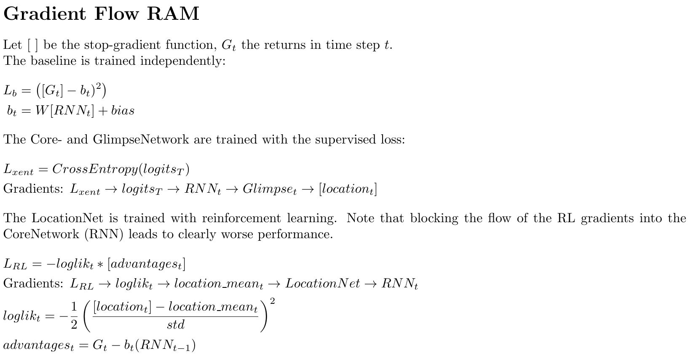

# Recurrent Attention Model

### Overview
This is a tensorflow implementation of Mnih et al.'s [Recurrent Models of Visual Attention](https://arxiv.org/pdf/1406.6247.pdf). It is trained with a hybrid loss:  
- Learn to classify the digits based on the RNN output in a supervised manner.
- Learn where to look next based on the RNN output. This is non-differentiable and therefore trained by reinforcement learning, using policy gradients (which easily allows to learn continuous actions of (x,y) coordinates).  
  

To run adjust the options in utility.py as needed and then run *main.py*. For cluttered Mnist and omniglot first obtain the data from the sources mentioned in the end and extract them in a folder /data/<dataset>.    

Requirements: tensorflow1.8, argparse, matplotlib, numpy, tqdm

### Results

| MNIST  | Error Mnih et al. | Error this |
| ------------- | ------------- | ------------- |
| RAM, 2 glimpses, 8 x 8, 1 scale  | 6.27%  | 7.70%  |
| RAM, 4 glimpses, 8 x 8, 1 scale  | 1.73%  | 1.07%  |
| RAM, 6 glimpses, 8 x 8, 1 scale  | 1.29%  | 0.67%  |

| 60x60 Translated MNIST  | Error Mnih et al. | Error this |
| ------------- | ------------- | ------------- |
| RAM, 4 glimpses, 12 x 12, 3 scales  | 2.29%  | 2.30%  |
| RAM, 6 glimpses, 12 x 12, 3 scales  | 1.86%  | 1.63%  |

| 100x100 Cluttered MNIST  | Error Mnih et al. | Error this |
| ------------- | ------------- | ------------- |
| RAM, 4 glimpses, 12 x 12, 4 scales  | 14.95%  | 15.14%  |
| RAM, 6 glimpses, 12 x 12, 4 scales  | 11.58%  | 10.09%  |

| Cifar10  | Accuracy | Details |
| ------------- | ------------- | ------------- |
| RAM, 4 glimpse, 8 x 8, 1 scale   |  59.7% | LSTM cell  |
| RAM, 4 glimpse, 8 x 8, 1 scale   |  66.6% | LSTM cell, Conv. GlimpseNet  |
| RAM, 6 glimpses, 8 x 8, 1 scale  |  61.6% | LSTM cell  |

### Visualization
Extensive examples of the whole training process [here](Results).

##### MNIST
6 glimpses:
  

##### 100x100 Cluttered MNIST
4 glimpses:  
    
6 glimpses:  
    

##### 32x32 cifar10
4 glimpses: it is not able to develop distinct policies and follows the same strategy for each input.  
    
6 glimpses: it is not able to develop distinct policies and follows the same strategy for each input.  
  

### Training
Controlling the gradient flow of the multpiple objectives is essential. We only train the location network by reinforcement learning, core and glimpse network are trained in a supervised manner:

- The variance of the location policy is an essential hyperparameter. Good values for MNIST seem to be around a standard deviation of 0.1.
- Monte Carlo sampling is used to achieve better approximations of the RL gradients.
- Using a tanh to squash the locations into normalized [-1, 1] range can offer mild improvements

### Computational performance
A large advantage of *hard attention* is the reduced computational cost, which no longer depends on the input size!
The complexity scales roughly linear in both the number of glimpses and number of scales per glimpse, as these actions 
cannot be parallelized. Simple MNIST is trained in less than 30 minutes on my Laptop GPU.

### Data sources:
- Cluttered MNIST: https://github.com/philipperemy/tensorflow-class-activation-mapping/tree/master/data
- Omniglot: https://github.com/brendenlake/omniglot
- cifar10: https://www.cs.toronto.edu/~kriz/cifar.html